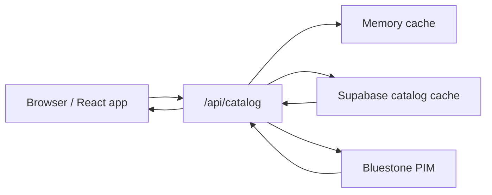

# Architecture

## Objetivo

Content Store es una aplicación interna para explorar catálogo, ficha de producto, variantes, acabados y archivos de productos almacenados en Bluestone PIM, con autenticación y configuración de tenant vía Supabase.

## Stack

- Frontend: Vite + React 18 + TypeScript + React Router
- UI: Tailwind CSS + componentes propios
- Backend HTTP: Vercel Serverless Functions en `api/`
- Datos de catálogo: Bluestone PIM
- Auth y caché persistente: Supabase
- Deploy: Vercel

## Módulos principales

### Frontend

- `src/app/App.tsx`
  - routing
  - login
  - catálogo
  - apertura de ficha
  - configuración
- `src/features/catalog/state/useCatalog.ts`
  - estado principal del catálogo
  - paginación
  - selección de producto
  - filtros y ordenación
- `src/features/catalog/state/useProductFetcher.ts`
  - fetch del catálogo paginado
  - reload y gestión de errores
- `src/features/catalog/ui/`
  - cards
  - header
  - sidebar de filtros
  - modal/ficha de producto

### Backend

- `api/catalog.ts`
  - endpoint principal del catálogo
  - filtrado y ordenación server-side
  - paginación
  - caché en memoria
  - caché persistente en Supabase
- `api/organizations.ts`
  - tenants visibles para la app
- `api/organization-settings.ts`
  - branding y configuración visual
- `api/asset.ts`
  - resolución de assets individuales

### Supabase

- auth de usuarios
- tabla de `profiles`
- tabla de `tenants`
- caché persistente de catálogo
- branding por tenant

## Flujo de datos principal

## Flujo del catálogo

1. El frontend construye una query de catálogo:
   - tenant
   - página
   - page size
   - sort
   - búsqueda
   - filtros
2. `api/catalog.ts` intenta resolverla desde caché:
   - memoria
   - Supabase
3. Si no hay caché válida, consulta Bluestone y reconstruye el índice
4. Devuelve una respuesta paginada:
   - `data`
   - `meta`

## Flujo de autenticación

1. Login vía Supabase Auth
2. La app carga `profiles`
3. Desde `profile.tenantId` se carga branding y contexto del tenant
4. El catálogo trabaja con ese tenant activo

## Entornos locales relevantes

- Frontend local: `http://localhost:4174`
- Proxy/API local: `http://localhost:3001`

El script recomendado de arranque es `npm run dev`, que levanta ambas piezas y limpia listeners viejos para evitar respuestas antiguas del proxy.

## Principios arquitectónicos actuales

- el grid debe cargar con índice ligero
- la ficha puede cargar más detalle bajo demanda
- producción no debe caer silenciosamente a datos locales
- tenant, fallback y fuente de datos son zonas de riesgo alto
